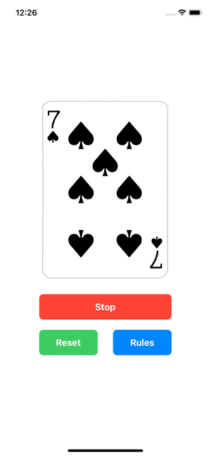

# IOSDevLaunchpad

Solutions to Sean Allen's "iOS Dev Launchpad" projects.

## Completion status

Type | Number | Completion
:--- | :---: | :---:
Projects | 4 / 4 | 100%

## Preview

*Within each project are larger versions of the screenshots.*

Projects / Topics | Screenshots
--- | ---
[Project 1](01-Project1/RandomColors) - *Random Colors*  (Storyboard UI)  UIKit |  |
[Project 2](02-Project2/CardWorkout) - *Card Workout*  (Storyboard UI)  UIKit |  |
[Project 3](03-Project3/CardWorkoutProgrammatic) - *Card Workout*  (Programmatic UI)  UIKit |  |
[Project 4](04-Project4/SwiftUIVideos) - *SwiftUIVideos*  (Programmatic UI)  SwiftUI |  |
